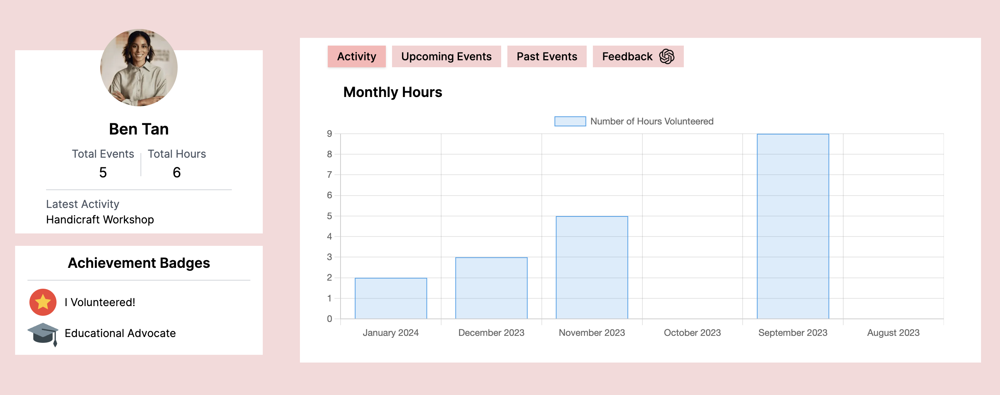
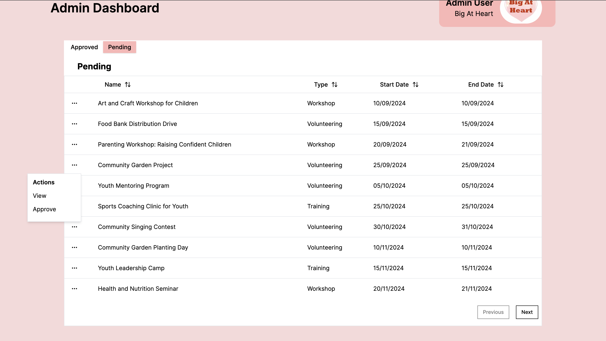

# big-heart-bros

Big Heart Bros aim to streamline the volunteering process, by allowing volunteers to sign up for events and organisations to put up requests for volunteers to join. Big At Heart simply have to approve or reject the request from the organisations.

-   Target User: Volunteers
-   Medium: Web app
-   Issue: Tedious process to sign and liase with volunteeers, and meaningful data collection
  
-   Additional Features:
1.   Recommender system to allow volunteers to have a more personalised experience
2. AI-generated testimonial for volunteers that will consolidate their volunteering experiences
3. Personalised statistics for volunteers
4. Sign-up and sign-in feature for volunteers (and data collection)

## User Flow


## Landing Page
<div style="display: flex;">
  
</div>

## Volunteering Page
<div style="display: flex;>
  
  
</div>
Purpose: Provide users with most crucial information.
Usage: Users can click on "View Event", which will lead to a pop-up event-sign page, where users can view more information
and join the event, viewing other info such as capacity, and registration deadline.

## User Dashboard
<div style="display: flex;>
  
  <!--  -->
</div>
Purpose: Gamify volunteering and allowing users to get achievements and see their stats (from volunteering).
Usage: Under "Activity", users can view their hours clocked. Users can also view events they signed up for under "Upcoming Events" and those that are completed under "Historical Events" Users can also view feedback and have a GenAI testimonial under "Feedback".

## Organisation Dashboard
<div style="display: flex;>
  
  
</div>
Purpose: Allow beneficiaries to track their events and apply for new events to Big At Heart.
Usage: Beneficiaries can press "View Event" at the right of each event to view their event information. They can also create new events under the "Create Event" button.

## Admin Dashboard
<div style="display: flex;>
  
  
  
  
</div>
Purpose: Allow Big At Heart to view all pending and approved events.
Usage: Admin can press "Pending" to view events awaiting approval and press the ":" button on the left to view/approve the events. After pressing "View", users will be brought to another page with event information and approval button below.


## Tech Stack and Configuration
This app uses:

-   Next.js
-   Nativewind CSS (Tailwind)
-   NextAuth.js
-   TypeScript
-   Prettier (Auto formatting)
-   Prisma
-   Supabase

<p align='center'>


  
</p>

## Folder structure
```
├── src/  
│   ├── app  
│   ├── components  
│   ├── constants  
│   ├── lib  
│   └── pages/api  
└── prisma
└── docs
```

## Get Started
Ensure that you have the following installed:
- [**Node.js**](https://nodejs.dev/en/download/)
- [**Git**](https://git-scm.com/downloads)
- [**Npm**](https://www.npmjs.com/package/npm)

Now do the following:
1. First git clone the repository
2. Then `cd` into the repository (`cd big-heart-bros/big-heart-bros`) and install dependencies with `npm install`
3. Run `npm run dev` to run the application
4. Go to localhost:3000 on your own device
