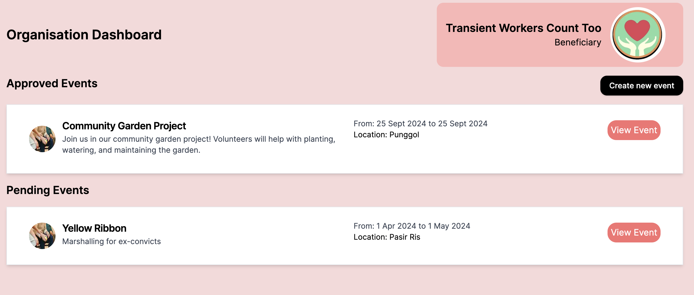

# big-heart-bros

Big Heart Bros aim to streamline the volunteering process, by allowing volunteers to sign up for events and organisations to put up requests for volunteers to join. Big At Heart simply have to approve or reject the request from the organisations.

-   Target User: Volunteers
-   Medium: Web app
-   Issue: Tedious process to sign and liase with volunteeers, and meaningful data collection
  
-   Additional Features:
1.   Recommender system to allow volunteers to have a more personalised experience
2. AI-generated testimonial for volunteers that will consolidate their volunteering experiences
3. Personalised statistics for volunteers
4. Sign-up and sign-in feature for volunteers (and data collection)

## User Flow


## Current Wireframe




## Tech Stack and Configuration
This app uses:

-   Next.js
-   Nativewind CSS (Tailwind)
-   NextAuth.js
-   TypeScript
-   Prettier (Auto formatting)
-   Prisma
-   Supabase

<p align='center'>


  
</p>

## Folder structure
```
├── src/  
│   ├── app  
│   ├── components  
│   ├── constants  
│   ├── lib  
│   └── pages/api  
└── prisma
└── docs
└── utils
    └── machineLearning
```

## Get Started
Ensure that you have the following installed:
- [**Node.js**](https://nodejs.dev/en/download/)
- [**Git**](https://git-scm.com/downloads)
- [**Npm**](https://www.npmjs.com/package/npm)

Now do the following:
1. First git clone the repository
2. Then `cd` into the repository (`cd big-heart-bros/big-heart-bros`) and install dependencies with `npm install`
3. Run `npm run dev` to run the application
4. Go to localhost:3000 on your own device
